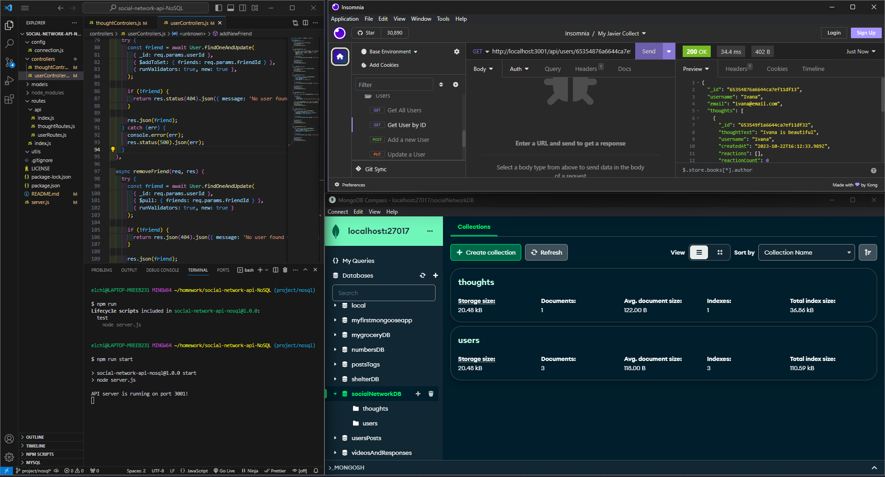

# social-network-api-NoSQL

## Description
This "Social Network API" project is a back-end application built with Node.js, Express, and MongoDB. It serves as the core engine for a social media platform and provides a robust API for managing users, friendships, and thoughts. Users can create profiles, add friends, and share their thoughts, which can also receive reactions from other users. Utilizing MongoDB's NoSQL database, the application efficiently handles complex queries and data relationships. Designed with scalability in mind, this API is perfect for developers looking to integrate social media features into their web or mobile applications.

## Table of Content
  * [Description](#description)
  * [Technologies](#Technologies)
  * [Installation](#installation)
  * [Usage](#usage)
  * [License](#license)
  * [Resources](#Resources)
  * [Deployment](#deployment)
  * [Questions](#questions)

## Technologies
* Visual Studio Code
* 

* Insomnia App
* 

* MongoDB Compass
* 

* Node.js
* 

* Express.js
* 

## Installation
For installation run the commands 'npm install' in the console and 'npm run start'. Also the nodemon will work. Run 'nodemon run start' to make the server auto restart when working on it.

## Usage
This is a small back-end project for a coding bootcamp with Kansas University and edX platform but the capabilities to make it scalable for a bigger development.

## License

## Resources
* https://www.mongodb.com/docs/
* https://expressjs.com/en/starter/installing.html
* https://www.mongodb.com/docs/manual/reference/operator/aggregation-pipeline/
* 

## Deployment
There is not deployment for this project but here is a video of 18 minutes which I tried to make it shorter but it was really hard to cover every step.
### Video Walkthrough
* https://drive.google.com/file/d/1enUxjU8B5Euk1A4pvSUaBHcwxTwo7Mj-/view
